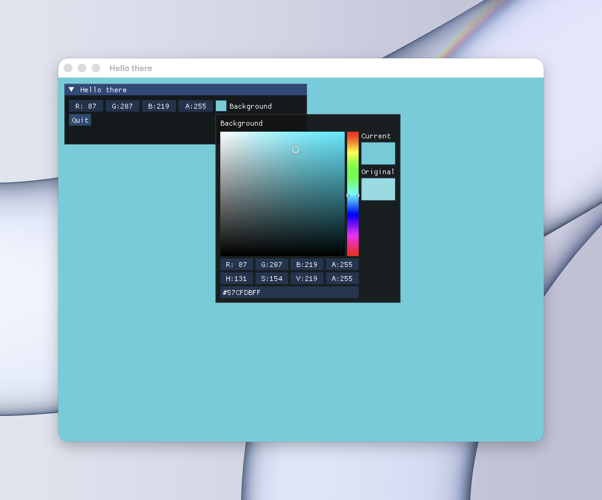

## sokol with imgui generated odin bindings

---



only macos (probably linux with minor changes)

- [Odin Language](https://odin-lang.org/)
- [dcimgui](https://github.com/floooh/dcimgui)
- [sokol](https://github.com/floooh/sokol) and [sokol-odin](https://github.com/floooh/sokol-odin)
- [odin-c-bindgen](https://github.com/karl-zylinski/odin-c-bindgen)

### Macos

```
brew intall gnu-sed
sh gen.sh
odin run demo.odin -file
```

---

Might be buggy and inconsequential (shocking, I know)
